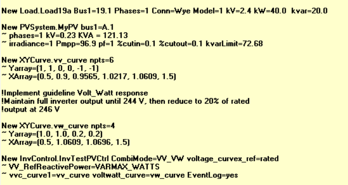

# Gymnasium Environment Construction
This section describes a three-step process for constructing a custion DSS-Gymnasium environment by constructing a set of linked Python files.  Please see the examples files for reference and the template files for copying to your own machine.  

1. build_circuit.py - this file builds and compiles your OpenDSS distribution circuit
2. build_environment.py - this file constructs a custom Gymnasium envionment class based on build_circuit.py
3. sb3_agent.py - this file selects a DRL algorithm from SB3 and trains/evaluates an RL agent in your environment

## Step 1: Building your OpenDSS Circuit
The first step in constructing a gymnasium environment involves importing your own personal benchmark distribution circuit via OpenDSS on which the user intends to conduct a study. 
These circuits are commonly used amongst the power systems research community, and they provide a solid starting point for evaluating your RL algorithms in both a centralized (operator) and/or a decentralized/local (device) approach.  After downloading OpenDSS, the IEEE benchmark distribution files can usually be found in the "./local_download_path/OpenDSS/IEEETestCases" folder and we have included a few of these circuits in the main directory for convenience, along with all of their required default .dss files to run.  More importantly, these circuits are only baseline models, and depending on the study, users typically will want to add components, devices, etc. to the circuit to simulate a modern realistic distribution system, including:
 
 * Loads and Generators
 * Distributed Energy Resources (Solar PV Systems, Wind, Battery Energy Storage Systems) (with or without inverter objects)
 * Loadshape/Time Series profiles (PV irradiance/temperature data, loadshape P,Q curves, etc.) for QSTS (quasi-static time-series) simulations
 * Monitoring and metering infrastructure (Monitors, Energy Meters)
 * Additional circuit components (switches, regulators, capacitor banks, etc.)
   
Generally, this can be accomplished in two ways:
1. Create a name.dss file by opening OpenDSS and following a similar structure as seen in the example files or in this [discussion](https://sourceforge.net/p/electricdss/discussion/).  This name.dss file can then be called in the Master.dss file when compiling the circuit as seen in the provided benchmark test system file folders:
 ---
 Add a new load:
 ---
 New Load.S19a Bus1=19.1 Phases=1 Conn=Wye Model=1 kV=2.4 kW=40.0  kvar=20.0
 
 ---
 Add a new PV System:
 ---
 New PVSystem.MyPV phases=3 conn=wye bus1=68 kV=4.8 kVA=100 irrad=1 Pmpp=95 temperature=25 PF=1 effcurve=Myeffcurve P-TCurve=MyPTcurve Daily=Myirradcurve TDaily=Mytempdata

OpenDSS editor example:





The Master.dss file then calls all other name.dss files and sets the circuit up for use.

2. Using the OpenDSSDirect interface, create a .py file which performs similar operations to customize your circuit.  For template usage see the template file build_circuit.py

Import packages
```python
"""
Build circuit from benchmark IEEE test cases, add components
"""
from opendssdirect import dss
import pandas as pd
```

Import the desired circuit
```python
def loadcircuit()
    dss.Command('Clear all')
    dss.Command('Redirect "local_path/Master.dss"')
    dss.Command('solve')  # get ss pflow 
```

Check bus names in circuit
```python
print(dss.Circuit.AllBusNames())
```

Add Monitors to loads
```python
def buildMonitors():
    for load in dss.Loads.AllNames():
        dss.Command('New Monitor.' + load)
        dss.Monitors.Element('Load.' + load)
        dss.Monitors.Terminal(1)  # phase a
        dss.Monitors.Mode(1)  # powers (all phases)
        dss.Command('~ ppolar=no')
```

OpenDSSDirect may be used to add any desired components to the circuit, as seen in the example files using build_circuit_template.py. The complete set of submodules for OpenDSSDirect is available [here](https://dss-extensions.org/OpenDSSDirect.py/opendssdirect.html)

Compile circuit 
```python
def runcircuit():
    loadcircuit()
    buildXYCurves()
    buildLoadshapes()
    buildPVs()
    buildStorage()
    buildMonitors()

if __name__ == '__main__':
    runcircuit()
```

**Note**:  Although Step 1 can be completed within the Gymnasium environment class (Step 2) we advise users to create a separate .py file to build the circuit as described here for a more efficient work flow.  This also provides flexibility in troubleshooting and bench testing elements of the circuit to verify specific outputs and desired behavior i.e. power flow results, active elements, inverter controls, new loadshapes, etc. 


## Step 2: Building your DSS-Gymnasium Environment
To construct the Gymnasium environment, this strategy follows the custom gymnasium environment protocol desribed [here](https://gymnasium.farama.org/introduction/create_custom_env/) by creating a subclass of the gym.Env class.  This unique structure allows for configuring the observation and action spaces for the agent, along with a reward function to reflect the optimization objective (with constraints), and "step" through an OpenDSS simulation, applying some specific control action by the agent onto the system or one of its components at each step followed by a load flow calculation.  In this manner, setting the Solution modes for OpenDSS for hourly or daily studies becomes directly intuitive within the closed-loop RL framework.  

First, create a new Python file which imports the build_circuit.py file from Step 1, along with the gymnsium library packages and OpenDSSDirect. See the template file build_environment.py.  
```python
import gymnasium as gym
from gymnasium.spaces import Discrete, Box, Dict  # gymnasium spaces
from gymnasium.spaces.utils import flatten_space
import opendssdirect as dss
import build_circuit
from build_circuit import *  # globals from circuit build
```

Next, create your environment class and set up your learning spaces from the Space superclass.  Choose the appropriate mathematical [spaces](https://gymnasium.farama.org/api/spaces/) to define your action(s) and observation(s).  For control over battery storage, for example, you may select a set of Discrete actions if you are only allowing the agent to either charge or discharge the battery (spaces.Discrete).  However, if you are controlling the battery state-of-charge (SoC) or real/reactive power output setpoints, for example, a continuous (spaces.Box) space is required.  The rule of thumb here is to maintain the per unit system within your environment and OpenDSS to keep the values of these vectors normalized and bounded to [-1,1]. For more complex spaces, a spaces.Dict can be used to capture multple observations of various types at each step.  **Please note that due to SB3 protocol some space vectors may require flattening to function properly.** 

```python
class myAgent(gym.Env):
    def __init__(self, none):
        super().__init__()
        # add any other dss cmds
        self.number_of_bess = len(dss.Storages.AllNames())

        # actions are charging/discharging of BESS
        self.action_space = Box(low=-1.0, high=1.0, shape=(self.number_of_BESS,), dtype=np.float64)

        # observations of a cost function and BESS SoC
        self.observation_space = Dict({'cost': Box(low=0.0, high=1.0, shape=(self.cost,), dtype=np.float64),
                      'soc': Box(low=0.0, high=1.0, shape=(self.number_of_bess,), dtype=np.float64),
                      'voltage': Box(low=0.9, high=1.1, shape=(self.number_of_bess,), dtype=np.float64)})
```

Sample your learning spaces
```python
print('my observation(s):', self.observation_space.sample())
print('my action(s):', self.action_space.sample())
```

**It is also extremely helpful to add helper functions within your environment class after the __init__() function to access certain elements, apply actions, or perform simple tasks which may be required for observing states depending on how the user has defined the degree of agent observability** 

Next, create a reward function which represents your agent objective using a numerical reward.  This is typically defined by the user and is a direct reflection of the objective (cost) function, where the constraints are reflected as numerical penalites per degree of violation. A reward function may contain many terms depending on the problem structure and generally takes some experimentation to get right.  The reward will be returned in the step() function after each new observation to the agent.  For example, a simple voltage limit penalty-based reward might be:

```python
    def reward(self, voltages):
        """
        build reward function based on operational voltage limit violations:
        --> voltage at bus within operational limits [0.95,1.05]pu = 0, else penalty
        """
        v_reward = []
        for voltage in voltages:
            if  0.95 <= voltage <= 1.05:
                volt_reward = 0.0
                v_reward.append(volt_reward)
            else:
                volt_reward = -1.0
                v_reward.append(volt_reward)
            else:
                pass
        reward = sum(v_reward) 
        return reward
```

Finally, create a step() and reset() function according to the gymansium protocol [here](https://gymnasium.farama.org/api/env/).  The step() function takes a control action sampled from the action space, so that the user may apply the action to the appropriate device(s) in the circuit.  This can be done using OpenDSSDirect to access any particulur element of interest.   After the action is applied, a power flow is computed based on the user's preference settings, and and observation of the resulting state spaces is returned with a reward.

The step() function samples an action from the space distribution, applies the action, conducts a 3-phase unbalanced DSS load flow, observes the new state(s), computes a reward, and returns all information (including a boolean indicating the last step in the simulation has been reached).  This function directly coincides with a QSTS simulation in OpenDSS daily mode.  

```python
    def step(self, action):
        """
        Apply agent actions, return obs, info, final step?, reward
        """
        # print('action:', action)
        self.ApplyRLAgentActions(action)
        self.Solution.Solve()  # dss load flow

        # obtain new observed state variables after power flow (return new observation)
        observation = self.Observations()
        info = self.getAdditionalInfo()  # any additional info
        reward = self.reward()  # custom reward function
        return observation, reward, self.Terminated, False, info
```

The reset() function resets your environment (DSS circuit) to its starting state for another episode, returning the initialized observation state and any additional information.

```python
    def reset(self, seed=None, options=None):
        print('resetting DSS environment')
        self.DSSFlatStart()
        self.episode_starting_hour = self.DSSSolutionParams()
        self.current_step = 1
        observation = self.Observations()
        info = self.getAdditionalInfo()
        return observation, info
```

Although SB3 offers data logging capabilities when training an agent in your environment, you may wish to add additional data acquisition functions which are utilized within the step() function to capture:
* Monitor or Energy Meter data
* Reward(s), action(s), state(s) and/or observation(s), and step counts
* Any additional data gathered in the environment useful to the user

## Step 3: Train your RL Agent
Once the environment is complete, a third Python file is created which imports the SB3 library and allows the user to select an [algorithm](https://stable-baselines3.readthedocs.io/en/master/guide/algos.html) based on the learning space configuration specified in the environment class.  See the template file sb3_agent.py, example files, and [documentation](https://stable-baselines3.readthedocs.io/en/master/guide/quickstart.html) for further details on training and evaluation. 

Import your environment
```python
from build_environment import myAgent
```

Select the Advantage Actor-Critic (A2C) algorithm
```python
from stable_baselines3 import A2C
```

**Prior to training, it is always recommended to test your custom environment to verify that all Gymnasium class structure protocol have been met.  The environment checker will check the following:
* learning space data type mismatch
* learning space vectorization and flattening (multidimensional spaces)
* step() function output
* reset() function output

```python
from stable_baselines3.common.env_checker import check_env
check_env(gym_env, warn=True)  # print warnings
```

To begin training, set the following parameters:
* desired Gymnasium environment
* discount parameter (gamma)
* specific NN [policy](https://stable-baselines3.readthedocs.io/en/master/guide/custom_policy.html) & hyperparmeters (learning rate, num rollouts, init seeds, etc.)
* the total number of steps = number steps in DSS simulation x number of desired episodes
* data output path (logger, save model, etc.)
* Tensorboard logger for automated real time SB3 plotting (see Tensorboard notes [here](https://stable-baselines3.readthedocs.io/en/master/guide/tensorboard.html) (optional)

Set the model (agent) 
```python
model = A2C("MlpPolicy", env=myAgent, gamma=gamma, learning_rate=learning_rate, tensorboard_log=log_path, verbose=1)
```

Train the model
```python
model.learn(total_timesteps=total_steps, progress_bar=True, tb_log_name="training A2C")
```

Save the model
```python
model.save(log_path + r'\agent_a2c.zip')
```

Generally, a testing environment can be created in a similar fashion by following Steps 1 & 2 with different time series data, circuit configurations, etc.  After passing a successful environment check, evaluating the trained policy is as simple as:
```python
model = A2C.load(log_path + r'\agent_a2c.zip')
mean_reward, std_reward = evaluate_policy(model, testing_env, n_eval_episodes=num_testing_runs)
print(f"mean_reward={mean_reward:.2f} +/- {std_reward}")
```

Keep in mind, the SB3 library contains a multitude of options and tools for customizing your training and building custom deep learning frameworks over the [PyTorch](https://pytorch.org/get-started/locally/) framework, and we advise all users spend adequate time navigating the SB3 [documentation](https://stable-baselines3.readthedocs.io/en/master/) prior to selecting an algorithm and beginning experimenting with DRL.

**The purpose of this repository is to provide a DSS-Gymnasium environment creation guide, and not to cover all aspects of OpenDSS, Gymnasium, and Stable-Baselines3. Thus, we encourage all users to spend time prior to utilizing these tools exploring and experimenting with all noted libraries and packages.**


