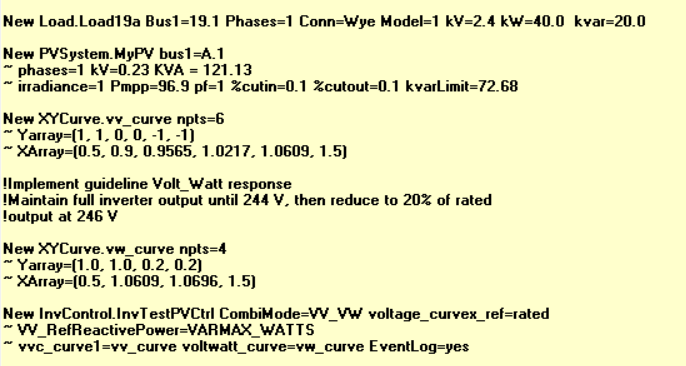

# Gymnasium Environment Construction

## Step 1: Building your OpenDSS Circuit
The first step in constructing a gymnasium environment involves importing your own personal benchmark distribution circuit via OpenDSS on which the user intends to conduct a study. 
These circuits are commonly used amongst the power systems research community, and they provide a solid starting point for evaluating your RL algorithms in both a centralized (operator) and/or a decentralized (device) approach.  After downloading OpenDSS, the IEEE benchmark distribution files can usually be found in the "./local_download_path/OpenDSS/IEEETestCases" folder and we have included a few of these circuits in the main directory for convenience.  More importantly, these circuits are only baseline models, and depending on the study, users typically will want to add components, devices, etc. to the circuit to simulate a modern realistic distribution system, including:
 
 * Loads and Generators
 * Distributed Energy Resources (Solar PV Systems, Wind, Battery Energy Storage Systems) (with or without inverter objects)
 * Loadshape/Time Series profiles (PV irradiance/temperature data, loadshape P,Q curves, etc.) for QSTS (quasi-static time-series) simulations
 * Monitoring and metering infrastructure (Monitors, Energy Meters)
 * Additional circuit components (switches, regulators, capacitor banks, etc.)
   
Generally, this can be accomplished in two ways:
1. Create a name.dss file by opening OpenDSS and following a similar structure as seen in the example files or in this [discussion](https://sourceforge.net/p/electricdss/discussion/).  This name.dss file can then be called in the Master.dss file when compiling the circuit as seen in the provided benchmark test system file folders:
 ---
 Add a new load:
 ---
 New Load.S19a Bus1=19.1 Phases=1 Conn=Wye Model=1 kV=2.4 kW=40.0  kvar=20.0
 
 ---
 Add a new PV System:
 ---
 New PVSystem.MyPV phases=3 conn=wye bus1=68 kV=4.8 kVA=100 irrad=1 Pmpp=95 temperature=25 PF=1 effcurve=Myeffcurve P-TCurve=MyPTcurve Daily=Myirradcurve TDaily=Mytempdata

OpenDSS editor example:





The Master.dss file then calls all other name.dss files and sets the circuit up for use.

2. Using the OpenDSSDirect interface, create a build_circuit.py file which performs similar operations to customize your circuit:

Import packages
```python
"""
Build circuit from benchmark IEEE test cases, add components
"""
from opendssdirect import dss
import pandas as pd
```

Import the desired circuit
```python
def loadcircuit()
    dss.Command('Clear all')
    dss.Command('Redirect "local_path/Master.dss"')
    dss.Command('solve')  # get ss pflow 
```

Check bus names in circuit
```python
print(dss.Circuit.AllBusNames())
```

Add Monitors to loads
```python
def buildMonitors():
    for load in dss.Loads.AllNames():
        dss.Command('New Monitor.' + load)
        dss.Monitors.Element('Load.' + load)
        dss.Monitors.Terminal(1)  # phase a
        dss.Monitors.Mode(1)  # powers (all phases)
        dss.Command('~ ppolar=no')
```

OpenDSSDirect may be used to add any desired components to the circuit, as seen in the example files using build_circuit_template.py. The complete set of submodules for OpenDSSDirect is available [here](https://dss-extensions.org/OpenDSSDirect.py/opendssdirect.html)

Compile circuit 
```python
def runcircuit():
    loadcircuit()
    buildXYCurves()
    buildLoadshapes()
    buildPVs()
    buileStorage()
    buildMonitors()

if __name__ == '__main__':
    runcircuit()
```

**Note**:  Although Step 1 can be completed within the Gymnasium environment class (Step 2) we advise users to create a separate .py file to build the circuit as described here for a more efficient work flow.  This also provides flexibility in troubleshooting and bench testing elements of the circuit to verify specific outputs and desired behavior i.e. power flow results, active elements, inverter controls, new loadshapes, etc. 


## Step 2: Building your DSS-Gymnasium Environment
To construct the Gymnasium environment, this strategy follows the custom gymnasium environment protocol desribed [here](https://gymnasium.farama.org/introduction/create_custom_env/) by creating a subclass of the gym.Env class.  This unique structure allows for configuring the observation and action spaces for the agent, along with a reward function to reflect the optimization objective (with constraints), and "step" through an OpenDSS simulation, applying some specific control action by the agent onto the system or one of its components at each step followed by a load flow calculation.  In this manner, setting the Solution modes for OpenDSS for hourly or daily studies becomes directly intuitive within the closed-loop RL framework.  

First, create a new build_environment.py file which imports the build_circuit.py file from Step 1, along with the gymnsium spaces and OpenDSSDirect. 
```python
import gymnasium as gym
from gymnasium.spaces import Discrete, Box, Dict  # gymnasium spaces
from gymnasium.spaces.utils import flatten_space
import opendssdirect as dss
import build_circuit
from build_circuit import globals  # globals from circuit
```

Next, create your environment class
```python
class myAgent(gym.Env):
```

Set up your learning spaces from the Space superclass.  Choose the appropriate mathematical spaces to define your action(s) and observation(s).  For control over battery storage, for example, you may select a set of Discrete actions if you are only allowing the agent to either charge or discharge the battery.  However, if you are controlling the battery state-of-charge (SoC) or real/reactive power output setpoints, a continuous (Box) space is required.  The rule of thumb here is to maintain the per unit system within your environment and OpenDSS to keep the values of these vectors normalized and bounded to [-1,1]. For more complex spaces, typically for observed states, a Dict can be used to capture multple observations of various types at each step. 

```python
    def __init__(self):
        super().__init__()
        # add any other dss cmds
        self.number_of_bess = len(dss.Storages.AllNames())

        # actions are charging/discharging of BESS
        self.action_space = Box(low=-1.0, high=1.0, shape=(self.number_of_BESS,), dtype=np.float64)

        # observations of a cost function and BESS SoC
        self.observation_space = Dict{'cost': Box(low=0.0, high=1.0, shape=(self.cost,), dtype=np.float64),
                      'soc': Box(low=0.0, high=1.0, shape=(self.number_of_bess,), dtype=np.float64),
                      'voltage': Box(low=0.9, high=1.1, shape=(self.num_bess,), dtype=np.float64)}
```

Next, create a reward function which represents your agent objective using a numerical reward.  This is typically defined by the user and is a direct reflection of the objective (cost) function, where the constraints are reflected as numerical penalites per degree of violation. 
```python

    def reward(self, voltages):
        """
        build reward function based on operational voltage limit violations:
        --> voltage at bus within operational limits [0.95,1.05]pu = 0, else penalty
        """
        v_reward = []
        for voltage in voltages:
            if  0.95 <= voltage <= 1.05:
                volt_reward = 0.0
                v_reward.append(volt_reward)
            else:
                volt_reward = -1.0
                v_reward.append(volt_reward)
            else:
                pass
        total_reward = sum(v_reward) 
        return total_reward
```


Finally,  create a step() and reset() function according to the gymansium protocol [here](https://gymnasium.farama.org/api/env/)


