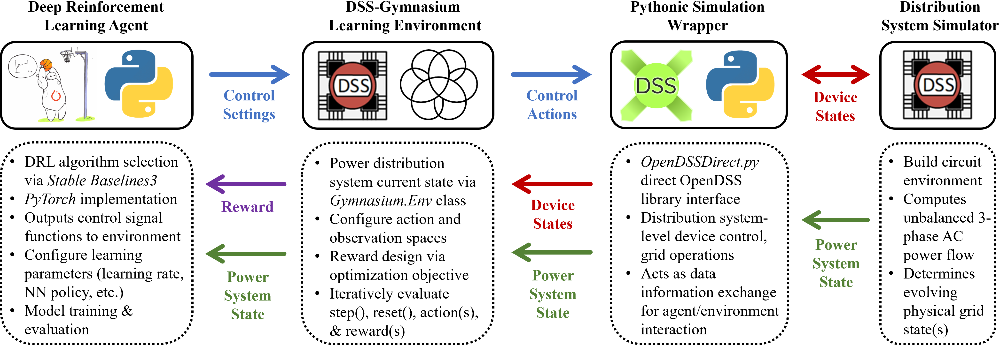

# DSS-Gymnasium
Welcome to DSS-Gymnasium, a project hub guide designed for assisting users in developing Deep Reinforcement Learning (DRL) environments for electric power distribution systems research using Python, OpenDSS (DSS), Gymnasium (Gym), and Stable-Baselines3 (SB3).

## Motivation
This repository is built to provide an instructional framework for building customized Gymnasium learning environments in OpenDSS for traditional optimization and control problems which may be converted 
into Markov Decision Processes (MDPs), and can be solved using model-free RL & DRL algorithms. 
The purpose of this repository is to provide a valuable resource for both new and experienced Python users involved in electric power distribution systems research to aid in the process of custom learning environment creation for any optimization-based task which can be solved by Deep Reinforcement Learning algorithms with OpenDSS.
We understand that in the domain(s) of power distribution systems optimization and control, there exist many different types of operational grid challenges (state estimation, emergency restoration, voltage regulation, DER dispatch, etc.), each requiring different mathematical formulations specific to the application.  This translates into unique customizations for problem conversion into learning-based formulations (objective, constraints etc.) as well as RL-based environmental structure (actions, rewards, etc.).  Therefore, instead of attempting to create one single learning environment suitable for all optimization/RL problems (this is highly impractical) as many have attempted, we feel it is more important to teach users how to construct their own environment(s) using open-source tools based on his/her own specific grid optimization task.  

## Research Reference
This tutorial is built on ongoing research in power distribution systems at Washington State University Pullman, WA in the [SCALE-Lab](https://anamika-dubey.github.io/) (Sustainable Climate-resilient Analytics for Large-scale Energy Systems) research group. The content of this repository is based on the following work:

<b>D. Glover</b>, G. Krishnamoorthy, H. Ren, A. Dubey and A. Gebremedhin, "Deep Reinforcement Learning for Distribution System Operations: A Tutorial and Survey," in Proceedings of the IEEE, doi: 10.1109/JPROC.2025.3599840..

## Citation (BibTeX)
@ARTICLE{11145317, <br>
  author={Glover, Daniel and Krishnamoorthy, Gayathri and Ren, Hongda and Dubey, Anamika and Gebremedhin, Assefaw},  
  journal={Proceedings of the IEEE},   
  title={Deep Reinforcement Learning for Distribution System Operations: A Tutorial and Survey},   
  year={2025},  
  volume={},  
  number={},  
  pages={1-29},  
  keywords={Optimization;Power systems;Tutorials;Deep reinforcement learning;Uncertainty;Reviews;Systems operation;Surveys;Markov decision processes;Distributed power generation;Deep reinforcement learning (DRL);grid services;Markov decision process (MDP);optimization;power distribution systems},  
  doi={10.1109/JPROC.2025.3599840}}  

  
## Toolkit Construction
The foundational framework utilizes OpenDSS, an open-source electric power distribution system simulator distributed by the Electric Power Research Institute [EPRI](https://sourceforge.net/p/electricdss/),
with the [Python](https://www.python.org/) programming language by way of [OpenDSSDirect](https://dss-extensions.org/OpenDSSDirect.py/#) and [DSS-Python](https://dss-extensions.org/DSS-Python/). OpenDSSDirect.py is a cross-platform Python package which
implements a "direct" library interface to a unique lower-level [implementation](https://github.com/dss-extensions/dss_capi) that allows users to automate OpenDSS processes using Pythonic functionality and other common packages.
The RL environment class structure is constructed through Farma's open-source package [Gymnasium](https://gymnasium.farama.org/), which is an updated fork based on the previous version from [OpenAi Gym](https://www.gymlibrary.dev/index.html), but with some improved customization capability.  For reinforcement learning implementation with neural networks, [Stable-Baselines3](https://stable-baselines3.readthedocs.io/en/master/) provides RL algorithm selection via [PyTorch](https://pytorch.org/) and allows for user model flexibility and design customized to each individual user's DRL implementation.





# Configuration
Next, we outline a basic workstation configuration to get started.  If you already have a working environment containing the following packages, or wish to skip directly to building your own DSS-Gymnasium environment, see the instructional [Environment Building Basics](./Environment_Building_Basics.md).

## Virtual Environment
We recommend users adopt an [Anaconda](https://www.anaconda.com/docs/getting-started/getting-started) distribution using Python ver. 3.10.13 (python 3.10+ applicable) to better manage development of the DSS-Gymnasium learning environment within a Conda virtual environment to allow for better package management and flexibility considering multiple projects.  Any common IDE (VSCode, PyCharm, etc.) which can run a Conda virtual environment should work just fine. 
Once Anaconda has been installed, open your Anaconda cmd propt and create your new virtual environment using:

```python
conda create -n myenvname python=3.10.13
```

Further help with installation and environment set up can be found here at [Managing Environments](https://docs.conda.io/projects/conda/en/stable/user-guide/tasks/manage-environments.html).  Make sure to install the latest version of [Pip](https://pypi.org/project/pip/) in your environment as well.  

## Installation
Upon environment activation, install the following open-source packages using pip or conda (see links in Toolkit Construction):
* gymnasium: 0.29.1
* opendssdirect-py: 0.9.4 (installs dss-python)
* Stable-baselines3: 2.3.2
* Pytorch: 2.3.0 (CPU or GPU) 
* TensorFlow: 2.19.0 (CPU or GPU) (optional for Tensorboard usage)

Also, install up-to-date and/or compatible versions of the common Python packages: [matplotlib](https://matplotlib.org/stable/install/index.html), [SciPy](https://scipy.org/install/), [Pandas](https://pandas.pydata.org/docs/getting_started/install.html) (required for OpenDSSDirect), and [Numpy](https://numpy.org/install/).  

Additionally, we include an optimization solver [Pyomo](https://www.pyomo.org/) as a part of the Anaconda virtual environment to allow users to compare RL performance against a traditional optimization solver. 

If you do not wish to manually build your Anaconda virtual environment, you may upload the [requirements.txt](https://github.com/dgloves/DSS_Gymnasium/blob/main/requirements.txt) file or the [dss_gymnasium.yml](https://github.com/dgloves/DSS_Gymnasium/blob/main/dss_gymnasium.yml) to create an environment which contains all of the above packages. 

## Building Your Custom DSS-Gymnasium Learning Environment
**Once your virtual environment is activated and you have verified all necessary packages have been correctly installed, view the [Environment Building Basics](./Environment_Building_Basics.md) file to begin constructing your DSS-Gymnasium environment.**

**Currently, we are working on additional environmental upgrades, including usage of control with Battery Energy Storage Systems (BESS) and Smart Buildings.  In addition, we are planning to add workarounds for SB3's single agent limitations for multi-agent applications (MADRL).  STAY TUNED!!**

## Contributing
This repo is meant to be forked, allowing users to independently develop their own working environments using the template files and following the examples provided.  Pull requests are welcome.  For significant changes, please open an issue first to discuss what you would like to change with respect to your particular issue.  We are continuing to add more use cases and expand this work.
